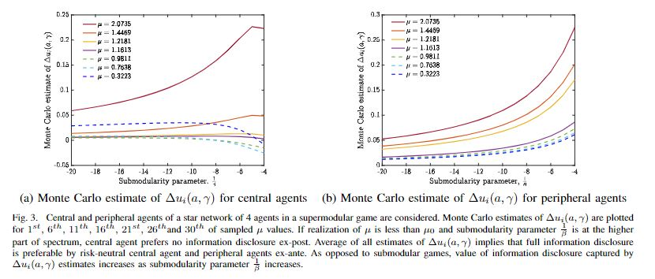
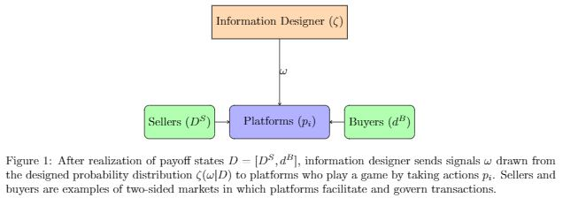

I am a 3rd year PhD student in [Industrial Engineering at Texas A&M University, USA](https://engineering.tamu.edu/industrial/index.html). My PhD research is on information design in games with applications to multiagent systems, e.g., smart grids and two-sided markets. I am conducting reseach under the supervision of [Dr. Ceyhun Eksin](https://netmas.engr.tamu.edu/). I obtained my BSc. degree from [Boğaziçi University Department of Industrial Engineering, Turkey](https://ie.boun.edu.tr/) in June 2019. I was an exchange student at [McGill University, Canada](https://www.mcgill.ca/) in Fall 2017.
 

# Research

## 1. Robust and Inverse Information Design (Dissertation Research)

### 1.1 Welfare Maximization and Conformism via Information Design
We considered linear-quadratic-Gaussian (LQG) games in which players have quadratic payoffs that depend on the players' actions and an unknown payoff-relevant state, and signals on the state that follow a Gaussian distribution conditional on the state realization. An information designer decides the fidelity of information revealed to the players in order to maximize the social welfare of the players or reduce the disagreement among players' actions. Leveraging the semi-definiteness of the information design problem, we derive analytical solutions for these objectives under specific LQG games. We also performed numerical studies to situations where analytical results is not possible.

**Furkan Sezer**, Hossein Khazaei, Ceyhun Eksin. Social Welfare Maximization and Conformism via Information Design in Linear-Quadratic-Gaussian Games, arxiv: 2102.13047 [math.OC], 2021. [[pdf]](https://arxiv.org/pdf/2102.13047.pdf)

### 1.2 Information Preferences of Individual Agents in Linear-Quadratic-Gaussian Network Games
We consider linear-quadratic-Gaussian (LQG) network games in which agents have quadratic payoffs that depend on their individual and neighbors' actions, and an unknown payoff-relevant state. An information designer determines the fidelity of information revealed to the agents about the payoff state to maximize the social welfare. Prior results show that full information disclosure is optimal under certain assumptions on the payoffs, i.e., it is beneficial for the average individual. In this paper, we provide conditions based on the strength of the dependence of payoffs on neighbors' actions, i.e., competition, under which a rational agent is expected to benefit, i.e., receive higher payoffs, from full information disclosure. We find that all agents benefit from information disclosure for the star network structure when the game is symmetric and submodular or supermodular. We also identify that the central agent benefits more than a peripheral agent from full information disclosure unless the competition is strong and the number of peripheral agents is small enough. 

**Furkan Sezer**, Ceyhun Eksin, Information Preferences of Individual Agents in Linear-Quadratic-Gaussian Network Games, 2022

### 1.3 Robust Optimization Approach to Information Design
In this thrust of research, we aim at developing robust information design against uncertainty in system data. In robust optimization framework, we have perturbed problem data, but we do not know exactly what is real system data. We also have a uncertainty set which gives us an idea regarding how much the real data is perturbed. If we solve the perturbed problem directly without considering the perturbation, the signals we designed will not perform as good as if we do it under robust optimization framework. In turn, we would have a suboptimal system objective value. 

**Furkan Sezer**, Ceyhun Eksin, Robust Optimization Approach to Information Design in Linear-Quadratic-Gaussian Games, 2022

### 1.4 Bilevel Multi-Follower Information Design
We analyze welfare maximization under a bilevel hierarchical structure. Leader designs information for the game played by managers. In turn, managers design information for the game played by employees. Payoff state of a manager is defined as weighted sum of payoff state coming from environment and social welfare of employees which he/she is responsible.  This model offers a novel way to look at hierarchical systems such as supply chains and armed forces.

**Furkan Sezer**, Ceyhun Eksin, Bilevel Multi-Follower Information Design in Linear-Quadratic-Gaussian Games, 2022

### 1.5 Information Design in Platform Competition under Ramsey Pricing
Platform competition refers to the competition among entities who serve as intermediaries between two or more user groups like merchants and buyers. We consider maximizing welfare of buyers and sellers and budget balance for monopoly platform. We derive optimal analytical results based on convexity of welfare functions. Numerical experiments identify the transition dynamics between different information disclosure policies.

**Furkan Sezer**, Justin Grana, Information Design in Platform Competition under Ramsey Pricing , 2022

## 2. Multi-Agent Reinforcement Learning

### 2.1 Policy Gradient Algorithms for Non-cooperative Multi-agent Reinforcement Learning 
We consider networked multi-agent reinforcement learning problem, in whichagents share their policies via communication network. Agents employ actor-critictype of an algorithm under the multi-agent setting of a Markov game. We show theconvergence of the algorithm to Nash equilibrium in Markov potential games.In numerical experiments, we simulated a networked Cournot game, an example ofpotential games. Numerical results verify the convergence to Nash equilibrium.

Sarper Aydin, **Furkan Sezer**, Jiachen Xi, Prachi Dutta, Decentralized Policy Gradient Algorithm in Markov Potential Games with Networked Agents, 2022

## 3. Mechanism Design for Decentralized Electricity Markets

### 3.1 Efficient and Incentive Compatible Mechanisms for Coupling Electricity Markets
The coordinated operation of interconnected but locally controlled electricity markets is generally referred to as a coupling. In this paper we propose a new decentralized market mechanism for efficient coupling of independent electricity markets. We show the mechanisms outcome converges to the optimal flows between markets given the reported supply and demand functions from each individual market clearing. In light of incentive compatibility issues that result from pricing power flows across interconnection lines with locational marginal prices, the mechanism features incentive transfers that compensate each given market with its marginal contribution. We show that these transfers imply truthful participation in the mechanism is a Nash equilibrium. The proposed decentralized mechanism is implemented on the three-area IEEE Reliability Test System where the simulation results showcase the performance guarantees of the proposed mechanism.

Alfredo Garcia, Roohallah Khatami, Ceyhun Eksin and **Furkan Sezer**, An Incentive Compatible Iterative Mechanism for Coupling Electricity Markets, IEEE Transactions on Power Systems, 2021, doi: 10.1109/TPWRS.2021.3100782.  [[pdf]](https://ieeexplore.ieee.org/document/9501497)

# Presentations

* Social Welfare Maximization and Conformism via Information Design in Linear-Quadratic-Gaussian Games
  * INFORMS Annual Meeting 2021, Anaheim, CA, USA, Oct 26, 2021
  * 32nd POMS Annual Conference, Online, April 21, 2022
  * IISE Annual Conference & Expo 2022, Seattle, WA, USA, May 21, 2022
  * European Control Conference 2022, London, UK, July 12, 2022
 

# Contact
E-mail: furkan.sezer@tamu.edu  
[Linkedin profile](https://www.linkedin.com/in/furkansezer/)  
[Google Scholar profile](https://scholar.google.com/citations?user=7UVlnAQAAAAJ&hl=en)  
[Github profile](https://github.com/furkansezer)  

