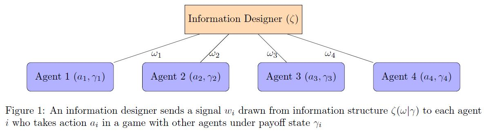
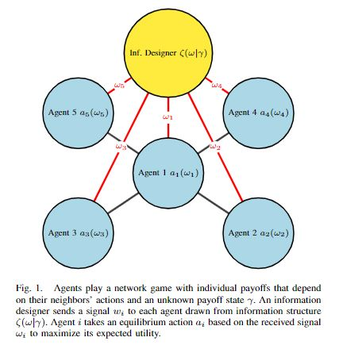

Furkan Sezer received the B.Sc. degree in [industrial engineering from Bogazici University, Istanbul, Turkey](https://ie.boun.edu.tr/) in 2019. He is currently working toward the Ph.D. degree in [industrial & systems engineering with Texas A&M University, College Station, TX, USA](https://engineering.tamu.edu/industrial/index.html). His PhD advisor is [Dr. Ceyhun Eksin](https://netmas.engr.tamu.edu/). His research interests include distributed optimization, game theory, information design, and electricity markets.

## Recent News
* I did a poster presentation at Texas A&M Energy Conference 2022 for my paper titled "Social Welfare Maximization and Conformism via Information Design in Linear-Quadratic-Gaussian Games".
* I will present my paper titled "Information Preferences of Individual Agents in Linear-Quadratic-Gaussian Network Games" at INFORMS 2022 Annual Meeting (Indianapolis, Oct 2022) and at Conference on Decision & Control 2022 (Canjun, Mexico, Dec 2022).

* My paper titled "Information Preferences of Individual Agents in Linear-Quadratic-Gaussian Network Games" is accepted for publication at IEEE Control Systems Letters (June 2022).
* I presented my paper titled "Social Welfare Maximization and Conformism via Information Design in Linear-Quadratic-Gaussian Games" at IISE Annual Meeting & Expo 2022 (Seattle, WA, May 2022)
* I presented my paper titled "Social Welfare Maximization and Conformism via Information Design in Linear-Quadratic-Gaussian Games" at POMS Annual Meeting 2022 (Virtual, April 2022)
* I presented my paper titled "Social Welfare Maximization and Conformism via Information Design in Linear-Quadratic-Gaussian Games" at INFORMS Annual Meeting 2021 (Anaheim, CA, October 2021)
# Research

## 1. Robust and Inverse Information Design (Dissertation Research)

### 1.1 Welfare Maximization and Conformism via Information Design
We considered linear-quadratic-Gaussian (LQG) games in which players have quadratic payoffs that depend on the players' actions and an unknown payoff-relevant state, and signals on the state that follow a Gaussian distribution conditional on the state realization. An information designer decides the fidelity of information revealed to the players in order to maximize the social welfare of the players or reduce the disagreement among players' actions. We show that full information disclosure maximizes social welfare when there is a common payoff-relevant state, when there is strategic substitutability in the actions of players, or when the signals are public.

**Furkan Sezer**, Hossein Khazaei, Ceyhun Eksin. Social Welfare Maximization and Conformism via Information Design in Linear-Quadratic-Gaussian Games, 2021 (revised). [[pdf]](https://arxiv.org/pdf/2102.13047.pdf)

### 1.2 Information Preferences of Individual Agents in Linear-Quadratic-Gaussian Network Games
Prior results show that full information disclosure is optimal under certain assumptions on the payoffs, i.e., it is beneficial for the average individual. In this paper, we provide conditions for general network structures based on the strength of the dependence of payoffs on neighbors’ actions, i.e., competition, under which a rational agent is expected to benefit, i.e., receive higher payoffs, from full information disclosure. We find that all agents benefit from information disclosure for the star network structure when the game is homogeneous. We also identify that the central agent benefits more than a peripheral agent from full information disclosure unless the competition is strong and the number of peripheral agents is small enough. Despite the fact that all agents expect to benefit from information disclosure ex-ante, a central agent can be worse-off from information disclosure in many realizations of the payoff state under strong competition, indicating that a risk-averse central agent can prefer uninformative signals ex-ante.

**F. Sezer** and C. Eksin, "Information Preferences of Individual Agents in Linear-Quadratic-Gaussian Network Games," in IEEE Control Systems Letters, 2022, doi: 10.1109/LCSYS.2022.3183539.[[pdf]](https://ieeexplore.ieee.org/document/9797065) 

Information Design over Star Network             |  Ex-post Information Preference Estimates
:-------------------------:|:-------------------------:
  |   
 

### 1.3 Robust Optimization Approach to Information Design
In this thrust of research, we aim at developing robust information design against uncertainty in system data. In robust optimization framework, we have perturbed problem data, but we do not know exactly what is real system data. We also have a uncertainty set which gives us an idea regarding how much the real data is perturbed. If we solve the perturbed problem directly without considering the perturbation, the signals we designed will not perform as good as if we do it under robust optimization framework. In turn, we would have a suboptimal system objective value. 

**Furkan Sezer**, Ceyhun Eksin, Robust Optimization Approach to Information Design in Linear-Quadratic-Gaussian Games, 2022

### 1.4 Bilevel Information Design
We analyze welfare maximization under a bilevel hierarchical structure. Leader designs information for the game played by managers. In turn, managers design information for the game played by employees. Payoff state of a manager is defined as weighted sum of payoff state coming from environment and social welfare of employees which he/she is responsible.  This model offers a novel way to look at hierarchical systems such as supply chains and armed forces.

**Furkan Sezer**, Ceyhun Eksin, Bilevel Information Design in Linear-Quadratic-Gaussian Games, 2022

## 2. Mechanism Design for Decentralized Electricity Markets

### 2.1 Efficient and Incentive Compatible Mechanisms for Coupling Electricity Markets
The coordinated operation of interconnected but locally controlled electricity markets is generally referred to as a coupling. In this paper we propose a new decentralized market mechanism for efficient coupling of independent electricity markets. We show the mechanisms outcome converges to the optimal flows between markets given the reported supply and demand functions from each individual market clearing. In light of incentive compatibility issues that result from pricing power flows across interconnection lines with locational marginal prices, the mechanism features incentive transfers that compensate each given market with its marginal contribution. We show that these transfers imply truthful participation in the mechanism is a Nash equilibrium. The proposed decentralized mechanism is implemented on the three-area IEEE Reliability Test System where the simulation results showcase the performance guarantees of the proposed mechanism.

Alfredo Garcia, Roohallah Khatami, Ceyhun Eksin and **Furkan Sezer**, "An Incentive Compatible Iterative Mechanism for Coupling Electricity Markets," in IEEE Transactions on Power Systems, vol. 37, no. 2, pp. 1241-1252, March 2022, doi: 10.1109/TPWRS.2021.3100782.  [[pdf]](https://ieeexplore.ieee.org/document/9501497)

## 3. Multi-Agent Reinforcement Learning

### 3.1 Policy Gradient Algorithms for Non-cooperative Multi-agent Reinforcement Learning 
We consider networked multi-agent reinforcement learning problem, in whichagents share their policies via communication network. Agents employ actor-critictype of an algorithm under the multi-agent setting of a Markov game. We show theconvergence of the algorithm to Nash equilibrium in Markov potential games.In numerical experiments, we simulated a networked Cournot game, an example ofpotential games. Numerical results verify the convergence to Nash equilibrium.

Sarper Aydin, **Furkan Sezer**, Jiachen Xi, Prachi Dutta, Decentralized Policy Gradient Algorithm in Markov Potential Games with Networked Agents, 2022

# Presentations

* Social Welfare Maximization and Conformism via Information Design in Linear-Quadratic-Gaussian Games
  * INFORMS Annual Meeting 2021, Anaheim, CA, USA, Oct 26, 2021
  * 32nd POMS Annual Conference, Virtual, April 24, 2022
  * IISE Annual Conference & Expo 2022, Seattle, WA, USA, May 22, 2022
  * European Control Conference 2022, London, UK, July 15, 2022
 

# Contact
E-mail: furkan.sezer@tamu.edu  
[Linkedin profile](https://www.linkedin.com/in/furkansezer/)  
[Google Scholar profile](https://scholar.google.com/citations?user=7UVlnAQAAAAJ&hl=en)  
[Github profile](https://github.com/furkansezer)  

